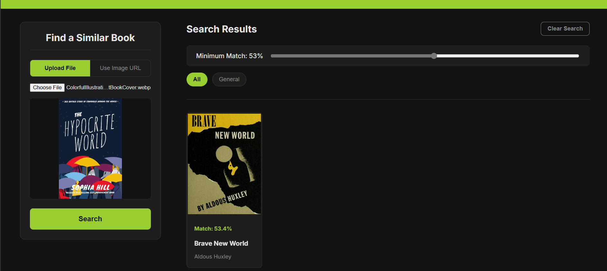

# 📚 Visual Book Matcher

**Visual Book Matcher** is a full-stack web application that finds visually similar book covers using AI.  
It combines a **React frontend** and a **Python backend** powered by the **Hugging Face Inference API**.

🌐 **Live Demo: [https://visual-product-matcher-5nqeia43c.vercel.app/](https://visual-product-matcher-nine-wheat.vercel.app/)**  
> Deployment was unsuccessful on free-tier platforms due to resource limitations of the local AI model.  
> The final architecture uses a lightweight API-based backend designed for successful deployment.  
> *(See “Problem-Solving Approach” for details.)*

---

## 📸 Preview





---

## 🧠 About The Project

Have you ever seen a book cover and thought, “What other books look like this?” 
**Visual Book Matcher** solves that problem by allowing users to upload an image or provide a URL of a book cover — and instantly receive visually similar books ranked by AI.

This project demonstrates a **production-ready full-stack AI web app** that balances intelligence, speed, and scalability, while staying deployable on free-tier cloud environments.

The architecture is **decoupled**:
- A modern **React + Vite frontend** for a fast, interactive user experience.  
- A **Flask-based backend** that handles image fetching and delegates AI computation to Hugging Face.

---

## ✨ Features

### 🔍 Dual-Mode Image Search
- Search by **uploading a local image**  
- Or by **pasting an image URL**

### 🤖 AI-Powered Similarity Matching
- Uses **CLIP-ViT-B-32** via the Hugging Face Inference API  
- Embeds book covers into vector space and ranks them using **cosine similarity**

### 🔁 “Find Similar” Reverse Search
- Click an icon on any book to find visually similar ones from the collection

### 🧩 Advanced Filtering
- **Similarity Slider** – filter by minimum match percentage  
- **Category Filter** – dynamically generated buttons to filter results by category

### 🪄 Polished, Responsive UI
- **Dark mode**, modern typography (Inter), and smooth animations  
- **Skeleton loaders** while fetching data  
- **Helpful empty states** for better UX  
- Fully responsive design that works beautifully on desktop, tablet, and mobile

### ⚡ High-Performance Backend
- **Image proxy and cache** for bypassing “hotlink protection” and speeding up image load times  
- **Pagination** for large collections and better performance

---

## 🧠 Problem-Solving Approach

A major challenge was deploying the AI model within **free-tier hosting constraints**.

Initially, the backend ran **PyTorch + Sentence Transformers** locally to process book cover images.  
However, this caused repeated build and memory issues:

- ⏱️ **Build Timeouts:** Model setup and Torch installation took over 10 minutes  
- 💾 **Memory Limits:** Most free-tier servers offer <1 GB RAM  
- 📦 **Large Dependencies:** Model + libraries exceeded 1.5 GB container size  

### ✅ The Architectural Pivot

The final solution was to **offload AI inference to the Hugging Face Inference API**.  
This transformed the backend into a **lightweight API gateway** that:
- Deploys easily on free-tier services (like Google Cloud Run)
- Stays under size and memory limits  
- Maintains full AI-powered functionality  
- Responds faster and scales more efficiently  

### Result:
A backend that is **lightweight**, **deployable**, and **AI-powered** — without the heavy cost of local inference.

---

## 🛠️ Tech Stack

| Layer | Technology |
|-------|-------------|
| **Frontend** | React, Vite, Tailwind CSS |
| **Backend** | Python (Flask, Gunicorn) |
| **AI Model** | Hugging Face Inference API (CLIP-ViT-B-32) |
| **Hosting** | Google Cloud Run (Backend), Vercel / Netlify (Frontend) |

---

## 💻 How to Run Locally

You’ll need **Node.js**, **Python**, and a **Hugging Face Access Token**.

---

### 🧩 1. Clone the Repository

```bash
git clone https://github.com/YOUR_USERNAME/visual-product-matcher.git
cd visual-product-matcher 
```
### ⚙️ 2. Set Up the Backend

``` bash
# Navigate to the backend folder
cd python-backend

# Create a .env file and add your Hugging Face token
# (Replace 'your_hf_api_token_here' with your actual token)
echo "HF_TOKEN='your_hf_api_token_here'" > .env

# Install dependencies
pip install -r requirements.txt

# Run the backend
python server.py

```

Once running, you’ll see:

✅ Backend running at http://127.0.0.1:5001

### 🌐 3. Set Up the Frontend

```bash
# Open a new terminal
cd frontend

# Install dependencies
npm install

# Create a .env file with the backend URL
echo "VITE_API_BASE_URL=http://127.0.0.1:5001" > .env

# Run the development server
npm run dev
```

Visit the frontend at 👉 http://localhost:5173
